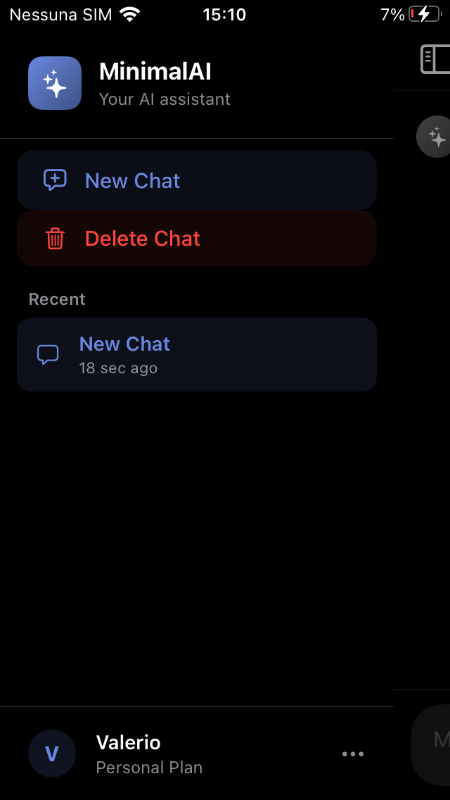
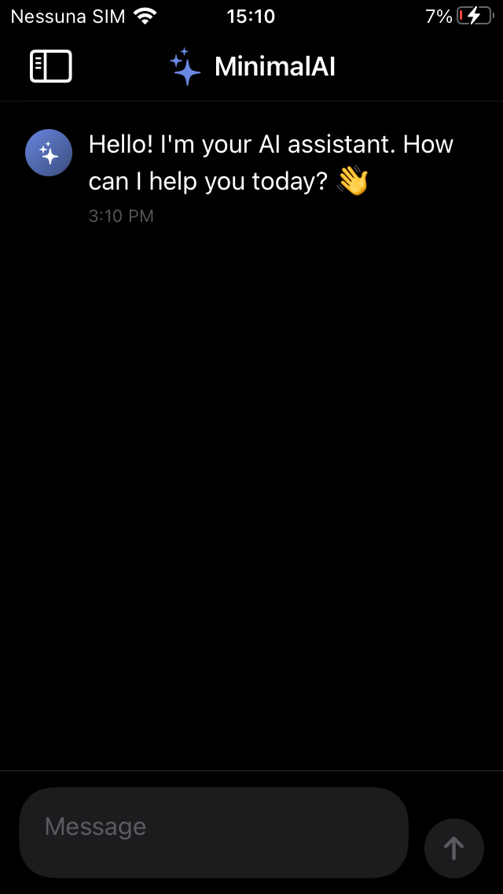
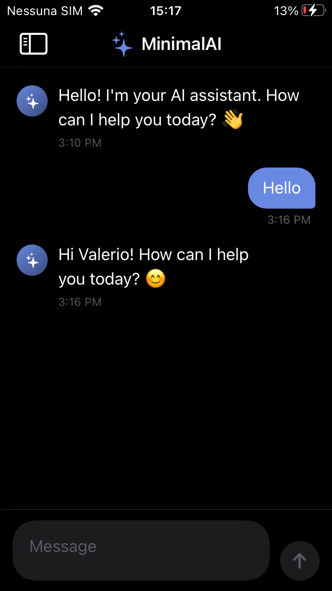

# MinimalAIChat

A native iOS 15 AI chat client designed to bring modern artificial intelligence capabilities back to legacy Apple devices.

  

  

  

## Features

MinimalAIChat is a native iOS 15 application built to replace clunky web interfaces for AI services like Gemini or ChatGPT, ensuring older devices can still leverage modern LLMs. 

* 🚀 **Ultra-lightweight:** Built with native SwiftUI and minimal dependencies for excellent performance on older devices.
* 💾 **Local History:** All your conversations are saved locally and securely on your device.
* 🧹 **Smart Auto-Cleanup:** Empty or accidental sessions are automatically cleared on the next app launch, keeping your sidebar clutter-free.
* 🔒 **Privacy First:** API calls travel directly from your phone to the provider. No intermediate servers, proxies, or data logging.

## Requirements

* **An iPhone running iOS 15.0** or higher.
* **A valid API key** from a compatible provider (OpenAI, Google Gemini, OpenRouter, etc.). The app utilizes a standard OpenAI-compatible "Chat Completions" endpoint format.

## Installation

Since this app is **not available on the App Store**, you will need to sideload it. The .ipa file provided in the [Releases](../../releases) section is unsigned and ready for either of the methods below.

### Option 1: TrollStore (Recommended)
If your device is running **iOS 14.0 through iOS 17.0**:
1. Install [TrollStore](https://github.com/opa334/TrollStore) on your device.
2. Download MinimalAIChat.ipa from the Releases tab and open it with TrollStore.
3. Click install. The app will remain permanently signed on your device without expiring.

### Option 2: AltStore / Sideloadly
Works on **any current iOS version**, as these tools sign the app using your personal Apple ID:
1. Install [AltStore](https://altstore.io) or [Sideloadly](https://sideloadly.io) on your computer.
2. Connect your iPhone and follow the respective tool's guide to install MinimalAIChat.ipa.
3. *Note:* Free Apple ID developer certificates expire every 7 days and require a manual or automated refresh. Paid Apple Developer accounts last for 1 year.

## How to Obtain an API Key

The app supports any provider that uses the standard "Chat Completions" endpoint layout. Here is how to get a key from the most popular services:

### Google Gemini
1. Navigate to [aistudio.google.com/app/apikey](https://aistudio.google.com/app/apikey).
2. Sign in with your Google account and accept the terms.
3. Click **Create API key**.
4. *Cost:* Offers a generous free tier with daily rate limits.

### OpenAI (GPT)
1. Navigate to [platform.openai.com/api-keys](https://platform.openai.com/api-keys).
2. Log in or create an account (*Note: This is separate from a ChatGPT Plus subscription, which does not grant API access*).
3. Click **Create new secret key** and copy it immediately (it won't be shown again).
4. *Cost:* You must add a payment method under **Billing** to fund your API usage balance.

### OpenRouter
An excellent choice if you want access to a variety of open-source and proprietary models (Anthropic, Meta, Mistral, etc.) using a single key:
1. Navigate to [openrouter.ai/keys](https://openrouter.ai/keys).
2. Create an account and add a small balance.
3. Click **Create Key**.

> ⚠️ **Security Warning:** Never share your API key publicly or commit it to a public repository. MinimalAIChat stores your key securely inside the iOS Keychain; it is never saved in plaintext and is only used for direct, local requests to your chosen provider.

## Community & Support

Need help setting up your API keys, want to report a bug, or have a feature request? Join our official community!

💬 **[Join the MinimalAIChat Discord Server](https://discord.gg/ryy2h6j5aq)**

## Technical Overview

* **Framework:** Built entirely with SwiftUI.
* **Minimum Target:** iOS 15.0.
* **Security:** Uses native iOS Keychain services for secure, hardware-accelerated API key storage.

## Contributing

Contributions, issue reports, and pull requests are highly welcome! Feel free to open an issue if you would like to request a build targeting a different iOS version.

## Development

MinimalAIChat was built using SwiftUI with extensive AI-assisted development. The application architecture, code review, debugging, and iterative improvements were developed through close collaboration between the author and modern AI coding assistants.
